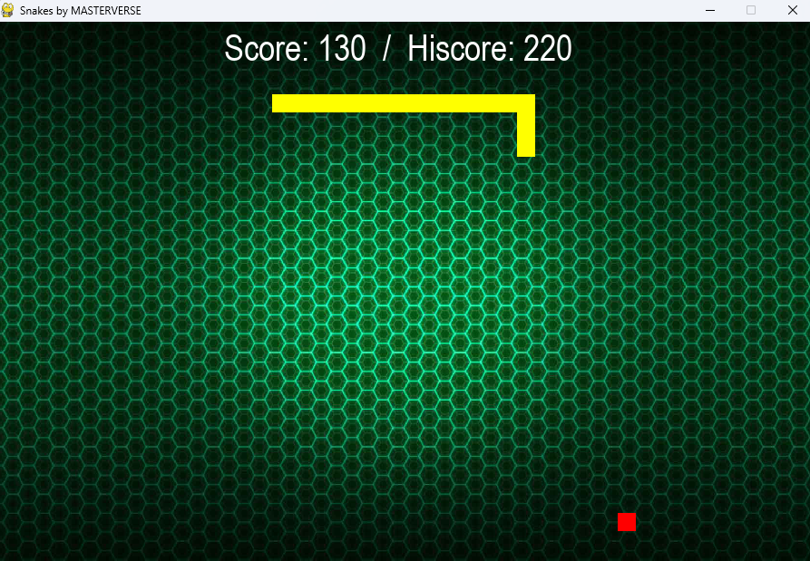

# SnakesPy


SnakesPy is a GUI game of Snake implemented in Python. It provides an enjoyable gaming experience with intuitive controls and interactive gameplay.

## Features
- Graphical user interface with smooth animations.
- Classic Snake game mechanics with a twist.
- Different levels of difficulty to challenge players.
- High score tracking to motivate competition.
- Sound effects for an immersive gaming experience.
- Customizable settings for personalized gameplay.

## Demo
[](https://www.youtube.com/watch?v=uP1oYtnxwEA)

Click the gif above to watch full demo video of SnakesPy on YouTube.

## Screenshots




## Usage
1. Clone the repository:
   ```bash
   https://github.com/Swapnil-11-04-01/SnakePy.git
   ```
2. Click Snakes.exe
